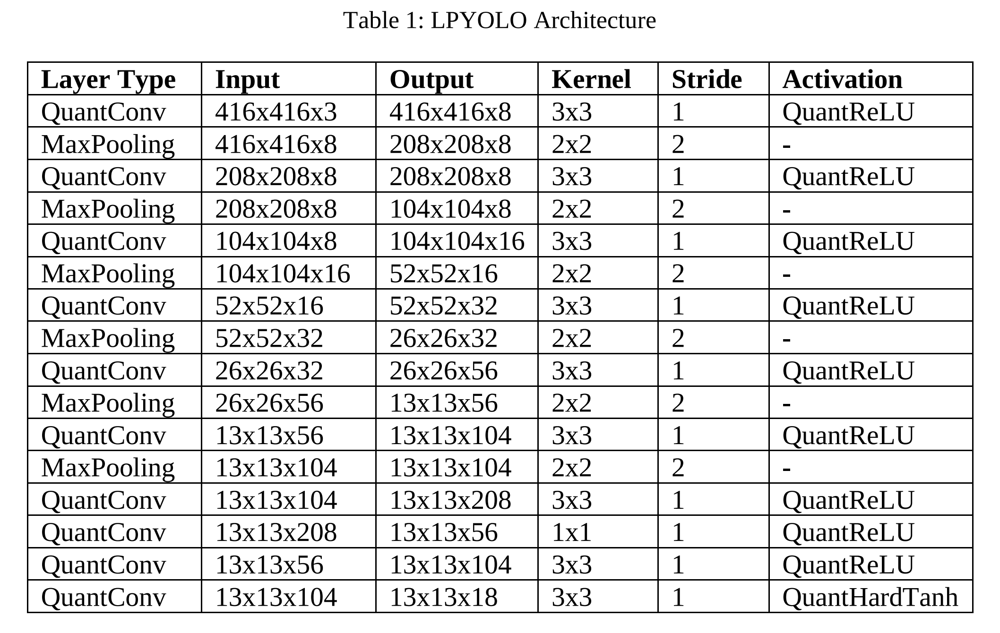

# LPYOLO: Low Precision YOLO for Face Detection on FPGA

## Contents
- [Introduction](#introduction)
- [Requirements](#requirements)
- [Installation](#installation)
- [Usage](#usage)
- [Evaluation](#evaluation)


## Introduction

This repo contains evaluation and deploy scripts of LPYOLO models.
Models are trained by [Brevitas](https://github.com/Xilinx/brevitas) which is a PyTorch research library for quantization-aware training (QAT) and exported to [ONNX]([https://onnx.ai). [FINN](https://github.com/Xilinx/finn) which is an experimental framework from Xilinx Research Labs to explore deep neural network inference on FPGAs is used for deploying models on a [PYNQ-Z2](http://www.pynq.io/board.html) board.


## Requirements

* Finn == 0.7
* Pytorch >= 1.8.1

## Installation

First, download [Pytorch armv7](https://github.com/KumaTea/pytorch-arm/releases/download/v1.8.1/torch-1.8.1-cp38-cp38-linux_armv7l.whl) and
[Torchvision armv7](https://github.com/KumaTea/pytorch-arm/releases/download/v1.8.1/torchvision-0.9.1-cp38-cp38-linux_armv7l.whl).

Then, run
```bash
pip install torch-1.8.1-cp38-cp38-linux_armv7l.whl
pip install torchvision-0.9.1-cp38-cp38-linux_armv7l.whl
```
on PYNQ-Z2 board.

Also, install bitstream
```bash
pip install bitstream
```

## Usage

First, connect a PYNQ-Z2 board and open a terminal.Then, clone the project:

```bash
git clone git@github.com:sefaburakokcu/finn-quantized-yolo.git
```
Then, download one of the deploy.zip file from the table below and extract. Copy _finn-accel.bit_, _finn-accel.hwh_ and _scale.npy_ into _src/deploy/bitfile/_.

**Model Definition**

Definition of LPYOLO architecture is given below.



**Pretrained Models**

| Models  | ONNX | Deploy |
| ------------- | ------------- | ------------- |
| 2W4A | [2w4a.onnx](https://1drv.ms/u/s!AoEINH-7w38TknHqzeVmJQplZW2w?e=1nByhb) | [2w4a_deploy.zip](https://1drv.ms/u/s!AoEINH-7w38TknB8WnaWuPN2Zz7m?e=yt26fl) |
| 3W5A | [3w5a.onnx](https://1drv.ms/u/s!AoEINH-7w38Tkm-HlWVrvBWsNmdL?e=liQFnf) | [3w5a_deploy.zip](https://1drv.ms/u/s!AoEINH-7w38Tkm7bsOBtDbwB5fED?e=HLRRHP) |
| 4W2A | [4w2a.onnx](https://1drv.ms/u/s!AoEINH-7w38TkmwXvTQCtZylDW-8?e=OHHCWO) | [4w2a_deploy.zip](https://1drv.ms/u/s!AoEINH-7w38Tkm3MW48Nf3x2DXGK?e=o2wy24) |
| 4W4A | [4w4a.onnx](https://1drv.ms/u/s!AoEINH-7w38TkmtJEyY25d04bB-_?e=4woj7w) | [4w4a_deploy.zip](https://1drv.ms/u/s!AoEINH-7w38TkmopP-uPADIHR3Ed?e=8poZTg) |
| 6W4A | [6w4a.onnx](https://1drv.ms/u/s!AoEINH-7w38Tkmjv1Wta4Rtr7L_c?e=0wQeXt) | [6w4a_deploy.zip](https://1drv.ms/u/s!AoEINH-7w38TkmmCQQeV_jJQSCPm?e=mPFI7A) |
| 8W3A | [8w3a.onnx](https://1drv.ms/u/s!AoEINH-7w38TkmZ25kggUNiveWzM?e=hcUMeh) | [8w3a_deploy.zip](https://1drv.ms/u/s!AoEINH-7w38TkmeyAMLvKjqTolG0?e=fhuJ6Q) |

Note: All models have 8 bits input and 8 bits output precisions. xWyA indicates x bits for weights and y bits precision for activations.

**Export**

Please follow steps given in [Medium Blog Post](unavailable) for exporting bitfiles from .onnx models.

**Inference**

Open _inference.ipynb_ under finn-quantized-yolo/src/deploy/driver in jupyter-notebook.

**Evaluation**

Under _src/deploy/_, run

```bash
python save_inference_results.py --source path-to-widerface-val-folder --outputs ./outputs/
```
